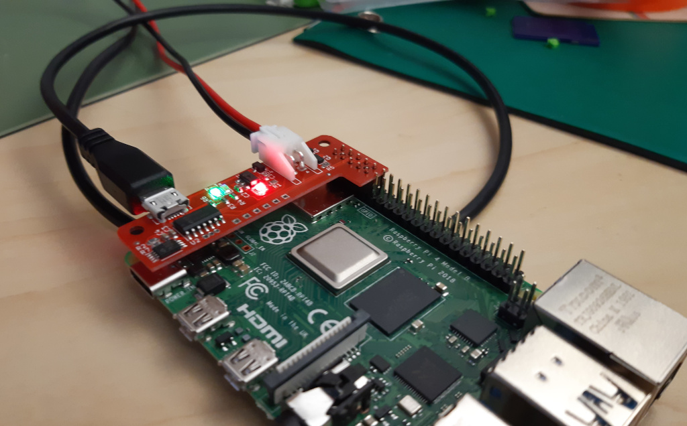
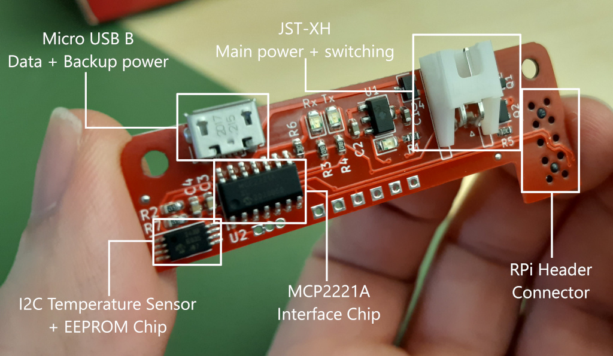

# Raspberry Pi Serial and Power Switching Hat

A Raspberry Pi Hat that provides USB serial access to the Pi's serial console. It allows for both power injection and switching via a JST-XH connector. There is also a combo temperature sensor/eeprom that can be accessed over USB.

Created for the [L41 Advanced Operating Systems](https://www.cl.cam.ac.uk/teaching/2021/L41/) course at UCAM CST.

## Board Details

### Notable ICs
* [MCP2221A](./docs/mcp2221a.pdf) - USB UART Interface chip, provides USB communications, GPIO control used for status LEDs and the power switching, and I2C interfacing to control the temperature sensor/eeprom.
* [MCP98243](./docs/mcp98243.pdf) - I2C temperature sensor and eeprom chip accessible via the MCP2221A. Could be substituted for other I2C chips as long as the power/GND and I2C pins match.
* [RQ5C060BC](./docs/rq5c060bc.pdf) - High power Pch MOSFET, can be substituted for any other high power (min 3A) MOSFET with a low gate threshold (must fully activate at Vgs = 3v3) and a GSD pin arrangement.

### Connectors
* Micro USB - Provides USB data and can provide power to the onboard ICs in the absense of the JST connector. No power is passed forward to the RPi however, so it cannot be powered from a single USB cable.
* [JST-XH](./docs/jst-xh.pdf) - Main power supply for the RPi, cables should be fitted with XHP-2 connectors with +ve on pin 1 and -ve on pin 2.
* RPi connector - Fits to the top end of the RPi GPIO header, uses a minimum of pins and leaves the remainder for other interaction.

## License

Designed by Thomas Bytheway for University of Cambridge.

Schematic details inspired by:
### [Adafruit-MCP2221](https://github.com/adafruit/Adafruit-MCP2221-PCB)
Designed by Limor Fried/Ladyada for Adafruit Industries.

### [Adafruit-PiUART](https://github.com/adafruit/Adafruit-PiUART-PCB)
Designed by Limor Fried/Ladyada for Adafruit Industries.

Creative Commons Attribution/Share-Alike, all text above must be included in any redistribution. See license.txt for additional details.

